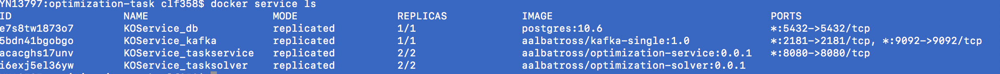

## Deployment

This article gives a brief introduction on how to deploy the application on the multi node cluster using docker swarm.

Use docker-compose-prod.yml for creating docker stack services. docker-compose-prod.yml will use the released docker images in repository to start and deploy them. The version of services and solvers are already released in docker hub repo. 

The doc assumes that we already have a docker swarm cluster installed.

docker-compose-prod.yml uses 2 replicas each of service and solver. It also has 1 node each for database and kafka. This script can be a starting point to deploy bigger sized application.
###  Starting docker swarm

docker swarm init

###  Deploying the docker service on the swarm

docker stack deploy -c docker-compose-prod.yml KOService

###  Checking the service

docker service ls

You can view containers running (Note: this will show your local containers only)

docker ps

###  Viewing the aggregated logs of task in the service

Aggregate logs of defined service tasks

docker service logs --follow KOService_taskservice

