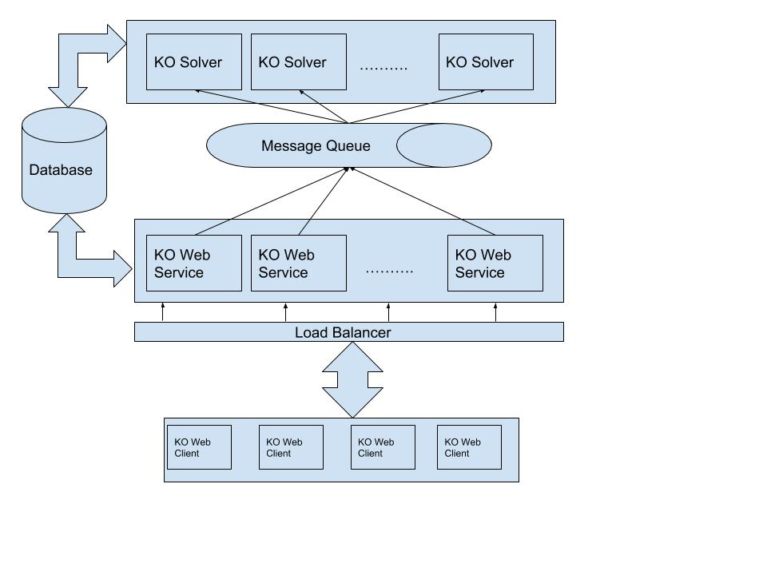

# Knapsack Optimizer Service

## Design

The KOS design has mainly 5 components, KOS Web service, KOS Solver, Message Queue ,Database and KOS Clients.  

1. **KOS Web service**: KOS Web service are services to create a Knapsack task, monitor the status of task and view the solution once task is done. 

2. **KOS Solver**: KOS Solver are the background services which receive the Knapsack problem, and update the status of the task, solves the task and update the result in database.

3. **Database**: Database is a metadata repository having description of tasks and their solution. it is integrated by KOS Web service and Solvers to keep this up to date.

4. **Message Queue** : Knapsack task is communicated from KOS Webservice to KOS Solver via a topic from the message queue. 

5. **KOS Clients**: KOS Clients can be a web browser, or any applications using the rest web services provided by KOS Service. 

The block diagram of the implemented solution is available below.

The webclients send request to KOS Webservice via API gateway which has round robin load balancer which can route the request to the appropriate KOS webservice. KOS webservice has createTask api which receives the problem and creates the task in database and assign it an id. It then sends the taskId to a topic in message queue, and update the status of task to submitted. There are KOS Solvers listening to the topic for new task and then solve them. Once KOS Solver receives the taskId it fetches the problem associated with taskId, update the status of task to started and starts solving the task. Once the task is solved it updates the task info in database with new solution and status of task as completed.

## Decision of stack

1. Why Message Queue ? 
 Message Queue was used with intention to separate the task of receiving request and processing the solution of problem. Message Queue helps in independent execution of tasks without further dependency on the 2 key components KO Service and KO Solvers. 
This task could have been done only with the database, but the cost of polling a database is expensive and may bring the database server down quickly, we need a separate way to achieve it, so here we use MQ.

2. Why RDBMS and not No SQL?
Since the nature of task is to solve optimization problem, which is not very big data task but is actually computationally intensive and needs more CPU cycles then disk memory. But in case in future when we have more historic data which needs to be stored in larger disks or more IO requests which RDBMS server cannot handle we may need to use NoSQL cluster.

## Handling scalability and performance

The main service which the KOS provides is solving knapsack problem. Understanding well that Knapsack problem can some times take longer for execution. The solver used takes o(n log n) complexity. 
The design provided is a Microservice based approach. The main focus is to scale the KO service to receive more requests, and solve the tasks for all requests with close or same latency of a single task solved with KO Solver. 

### Scaling to manage with more user requests: 

We need to see the kind of requests received by the user is submitting for more task or just checking the solution, i.e reads vs writes. It is very important to understand that frequency of reading requests in most cases will be high then create tasks(writes). We can say the reading requests are high only when the task queue has no long waiting. We can fix the amount of task waiting in the queue at a given time to a threshold, and receive the metrics when this value shoots up then a decided threshold it is the load due to create task. Otherwise it is a read requests load.

a. **Create task requests are high**: In this case we see a long waiting task queue in the topic of message queue. Adding more KO Solvers listening on the queue can solve the problem.

b. **Read requests are high**: Measure the requests received by the KO webservice and if the request received per second per webserver is higher to the threshold. In this case adding more KO Web service behind the load balancer will work. It is also desirable to see the response time of database servers, if they are slowed down from a particular threshold of the measurement of number of reads/sec and writes/sec. In this case we may need to add another database server too depending on the issue, as slowing read/sec and write/sec can also be related to hard disk issue, in that case another replica of the database server should do. 
    
### Fault tolerance

For KOS the fault can be defined as below:
1. Loss of task
2. KO Solver is crashed
3. KO Service is crashed

Fault tolerance can be ensured in the design by key deployment features using orchestron and container managements systems (like Kubernetes, docker swarm etc) which can deploy replicas of services and solvers and restart or scale them when needed.

Loss of task is managed by broker based message queue (like kafka) which keeps the message(taskId) even when the Solvers are crashed while processing or disk is crashed. These brokers can be replayed from any point.
  
Database servers can be backed up with replica to avoid data loss.

## Implementation

### Choice of stack
The above design is implemented using following technology: 
1. Jetty Webserver (KOS Webservice)
2. Postgres SQL Server (Database Server)
3. Apache Kafka (Message Queue)
4. Docker (Docker for image creation, compose for execution of the entire stack)

other tools, frameworks and programming languages used:
1. git
2. maven (build management system)
3. Java 8
4. Spring boot
5. Hibernate
6. testng/junit
7. bitbucket
  
####  Justification of Choice

1. Java 8 - Strong ecosystem with tools and libraries around server, webservice, and distributed computing.
2. maven - popular build and dependency management system, supports java very well
3. git - popular distributed revision control system, makes merge and collaborative development easy. Better cloud solutions available like github,gitlab, and bitbucket.
4. bitbucket - popular git offering, used because private repositories are free.
5. Spring boot and Hibernate: Popular frameworks for microservices development, quick and easy configuration, focus on problem rather than writing redundant codes. Hibernate is famous ORM framework for database. The code will be portable irrespective of database, only need to change the configuration.
6. testng/junit: testng to get beautiful test reports without having any additional plugins. junit spring has good integration with junit and need to use it.
7. Postgres SQL : popular, open source database server and supported by hibernate, easy to use available docker images for automation.
8. Kafka : Needed message broker, for reliable messaging. topic can be paritioned and the consumers in same group can read this topic parallely (feature of kafka to obtain parallelism).
9. Jetty: Most of the webservers have same features, used jetty as it is embeddable (can run from jar) and light weight. 
10. Docker: Docker is famous container based virtualization tool. It also provide tool for distributed deployment and provisioning of several services.

 

 